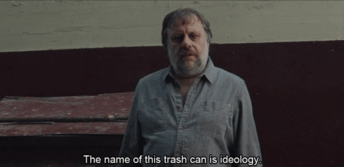

# to do

- important (meta)action: request (asking someone else to do something)
    - e.g. ask for information
    - e.g. ask for a task (this is a meta-meta action! i.e. requesting a request)
    - request target is under no obligation to fulfill the request
- general action schema
    - can have a target, or not, i.e. transitive vs intransitive actions
    - can have arbitrary data associated with it
- "natural" social network formation based on preferences/utilities
- "think ahead" - planning component. people need to be able to imagine consequences of their actions

"impatience" attribute, which weights how far things in the future matter (k value for temporal discounting)
"obedience" attribute, how much a person values obeying to authority

examples/demos to do:

- coercive/authoritative relationship/obedience
- temporal discounting/planning
- state of nature scarcity/competition

---

# proposed agent design

Goals:

- autonomous agents that make bounded-rational decisions
- reasonable computation requirements
- agent preferences (ideologies) configurable at the individual level
- easily adaptable to different scenarios

Components:

- agents
- world/environment

Agents will execute actions in a random sequence so no agent gets "first-mover" advantage. This means that agents may need to re-select their action if the world state has changed.

Agents can easily evaluate the "immediate" effects of an action using the utility system. But agents need to anticipate the future consequences of their actions ("think ahead"). We can do this using a state tree where the agent "imagines" possible outcome states. The agent computes the utility of that outcome state, discounted by an "impatience" factor (this is the $k$ value in hyperbolic discounting), and add that to the immediate outcome utility.

We have to limit the depth of this state tree for both computational feasibility reasons and because people typically don't think extremely far ahead about their actions. We can configure the depth to which this tree is expanded at the individual level with a "foresight" parameter (i.e. it is the depth to expand out to).

We also want to limit the breadth of this state tree. Scenarios may potentially have many, many actions available to agents, and it will take too much time to exhaustively consider them all. Furthermore, since the actions of other agents will affect the world state, each agent must also consider other agents' possible actions. For both cases, we want to reduce the number of actions considered. Actions that the agent takes themselves will be called "personal actions" and actions taken by other agents "impersonal actions" (? better names maybe?).

To limit personal actions, we can use a reinforcement learning technique like Q-learning. We can either pre-install agents with a pre-defined "memory" (i.e. a pre-defined Q) or "incubate" agents in a simulation with pre-programmed agents ("droids"). These droids would have more explicitly defined rule-based behavior and provide an environment for the agent to "grow up" in. In either case, agents will end up with associations between actions and rewards/outcomes. They can use this to choose an action (choose the action with the best learned reward) in a manner like heuristic thinking (we can call this way of valuing actions "intuition" and this method of choosing an action "habit"). This method does not require any "thinking ahead", just a lot of experience and learning. During the learning process, we can also include an exploration parameter ("curiosity") and disable or attenuate it after the agent has "grown up".

We use heuristic thinking (i.e. "system 1" thinking) but we can also think more deliberately ("system 2" thinking, i.e. "thinking ahead"). Similarly, agents should be able to "think ahead" about particular actions. Again, we don't want to exhaustively consider all actions. Instead, we can consider some smaller amount of actions at random, drawn from a distribution computed using the heuristic thinking's rewards. Or, maybe more appropriately, the agent remembers how many times it has taken particular actions (i.e. how many datapoints it has about each action) and thinks deliberately about the actions it is uncertain about (i.e. that it has less datapoints for). Note that some default value must be assigned to unknown actions (actions for which there is no or very little data about, that is, nothing or very little is known about what the outcome of that action could be). This value could be called "adventurousness" or conversely "fear of the unknown".

Considering impersonal actions is tricky. Agents shouldn't exhaustively consider all possible actions by all possible other agents (that would blow up). Instead we can consider only the actions of "local" agents. For "local" we need a notion of "distance", which is not (necessarily) physical distance, but rather, the immediacy someone is in their sphere of influence (that is, whether or not their actions directly affect them).

Though this reduces the number of impersonal actions an agent would need to consider, it still might be a considerable amount. We could also reduce all other agents to an "other" and have agents think of this aggregate other as a single entity. The agent could do a small-ish sample from the other and consider only their possible actions, then extrapolate that to the other as a whole.

We might also want a way for norms to spread throughout a social network. We can use a basic imitation model, e.g. agents imitate or more positively value the actions of those who are very successful or just more successful (success as in they have a higher perceived utility) than they are. They may only noisily/imperfectly imitate actions.

other things to capture:

- communication and reputation
- "promises", which could be something like a promise of payment or a threat of pain
- trust - an edge attribute between people in a network, which is the confidence that the trustee will execute on a promise
    - perhaps reputation is just the way trust diffuses through the network? (i.e. trust-by-proxy)